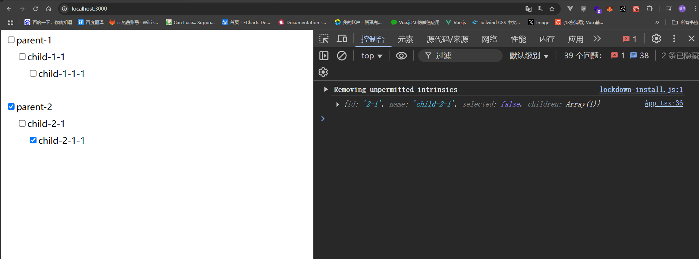
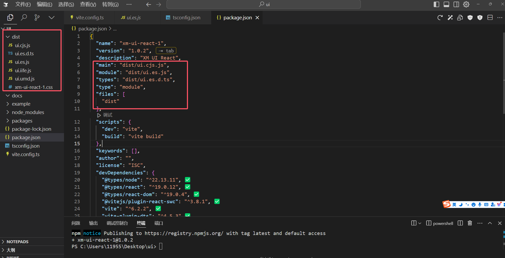
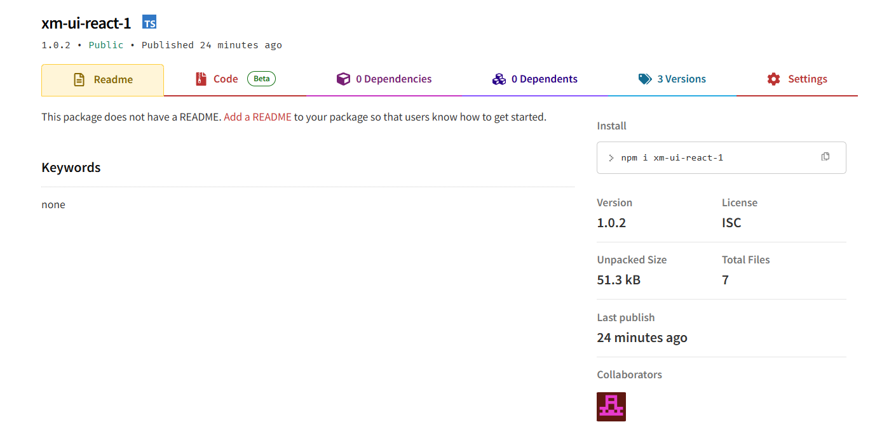
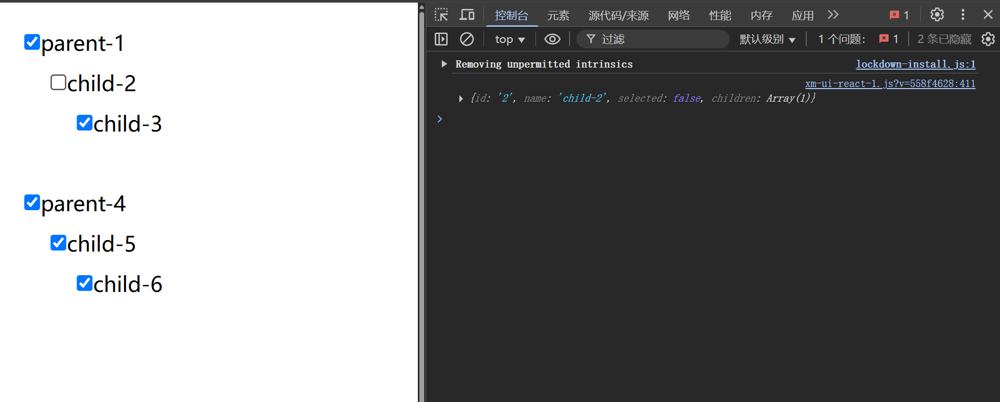

# 组件实战

:::warning
这一章建议大家看完`hooks` `css` `原理` `组件` 这些章节之后再来看，这样会更好理解。
:::

本章是额外新增的，因为之前的知识大家都掌握的差不多了，所以这一章节主要是让大家动手实践，巩固一下前面的知识。

### 那么你会学到什么？

1. 如何实现一个`Tree`组件
2. 递归组件的用法
3. 组件库封装
4. 前端打包格式 `UMD` `ESM` `CJS`
5. 组件库发布`npm`


### 目录创建

- dist `打包文件`
- docs `文档`
- packages `组件`
  - Tree
    - index.ts `入口`
    - tree.tsx `组件`
    - styles.css `样式`
    - type.ts `类型`
  - Button
    - index.ts `入口`
    - button.tsx `组件`
    - styles.css `样式`
    - type.ts `类型`
  - index.ts `组件汇总`
  - vite.d.ts `类型`
- example
  - index.html `示例`
  - App.tsx `示例`
  - main.tsx `示例`
- package.json `包管理`
- vite.config.ts `vite配置`
- tsconfig.json `ts配置`
- README.md `README`

:::tip
package.json 可以通过 `npm init -y` 生成

tsconfig.json 可以通过 `tsc --init` 生成
:::


### 所需要的依赖

```bash
npm install vite -D # vite 构建工具
npm install @vitejs/plugin-react-swc -D # 插件编译React
npm install vite-plugin-dts -D #生成d.ts文件 声明文件
npm install react #react依赖
npm install react-dom #react依赖
npm install @types/react -D # 类型
npm install @types/react-dom -D # 类型
npm install @types/node -D # 类型
```

### 初始化文件

- example/App.tsx

```tsx
export default function App() {
  return <div>Hello World</div>
}
```
- example/main.tsx
```tsx
import React from 'react'
import ReactDOM from 'react-dom/client'
import App from './App'
ReactDOM.createRoot(document.getElementById('root') as HTMLElement).render(
    <App />
)
```
- example/index.html
```html
<!DOCTYPE html>
<html lang="en">
<head>
    <meta charset="UTF-8">
    <meta name="viewport" content="width=device-width, initial-scale=1.0">
    <title>example</title>
</head>
<body>
    <div id="root"></div>
    <script type="module" src="./main.tsx"></script>
</body>
</html>
```
因为vite默认是从根目录找`index.html`文件，但是我们的项目结构是`example/index.html`，所以需要配置`vite.config.ts`
- vite.config.ts
```ts
import { defineConfig } from 'vite'
import react from '@vitejs/plugin-react-swc'
export default defineConfig({
  plugins: [react()],
    root: path.resolve(__dirname, 'example'),
    server: {
        port: 3000,
        open: true,
    },
})
```
- tsconfig.json
```json
{
  "compilerOptions": {
    "target": "ESNext",
    "module": "ESNext",
    "moduleResolution": "NodeNext",
    "jsx": "preserve",
    "jsxImportSource": "react",
    "strict": true,
    "skipLibCheck": true,
    "forceConsistentCasingInFileNames": true,
  },
  "include": ["packages/**/*", "vite.config.ts"]
}
```
- package.json
```json
{
  "scripts": {
    "dev": "vite",
    "build": "vite build"
  },
}
```
### 核心逻辑编写

1. 首先需要确定声明文件，`TreeNode`定义每一个叶子结点的类型，`TreeProps`定义组件的属性

- packages/Tree/type.ts

```ts
export interface TreeNode {
    id: string | number //id用于绑定key
    name: string //name用于显示
    children?: TreeNode[] //children用于存储子节点
    selected: boolean //selected用于存储节点是否选中
}

export interface TreeProps {
    data: TreeNode[] //数据源
    onChecked: (node: TreeNode) => void //选中回调
}
```

2. 组件的实现,其核心思想就是递归，如果出现了`children`，就继续递归调用自身。

- packages/Tree/tree.tsx

```tsx
import React, { useState } from 'react'
import './styles.css'
import type { TreeProps, TreeNode } from './type'
const Tree: React.FC<TreeProps> = ({ data, onChecked }) => {
    const [treeData, setTreeData] = useState(data)
    const changeSelected = (e: React.ChangeEvent<HTMLInputElement>, item: TreeNode) => {
        setTreeData(treeData.map(node => node.id === item.id ? { ...node, selected: e.target.checked } : node)); // 更新选中状态
        onChecked && onChecked({ ...item, selected: e.target.checked }) // 触发回调
    }
    return (
        <div>
            {
                treeData.map((item) => {
                    return (
                        <div key={item.id}>
                            <input onChange={(e) => changeSelected(e, item)} type="checkbox" checked={item.selected} />
                            <span>{item.name}</span>
                            <div className='tree-node'>
                                {
                                    item.children && <Tree data={item.children} onChecked={onChecked}></Tree>
                                }
                            </div>
                        </div>
                    )
                })
            }
        </div>
    )
}

export default Tree;
```

3. 样式文件的编写(主要是为了有点边距)
- packages/Tree/styles.css
```css
.tree-node {
   margin-left: 10px;
   padding: 10px;
}
```
4. 组件的入口文件(为了方便使用，需要导出组件和类型)
- packages/Tree/index.ts
```ts
import Tree from './tree'
export * from './type'
export { Tree };
```

5. 组件的汇总文件(为了方便使用，需要导出组件和类型)
- packages/index.ts
```ts
import { Tree } from './Tree'
import { Button } from './Button' //例子
import { Input } from './Input' //例子
export * from './Tree'
export * from './Button' //例子
export * from './Input' //例子
export {
    Tree,
    Button,
    Input
}
```

6. App.tsx 使用

```tsx
import React from 'react'
import { Tree, type TreeNode } from "../packages"
export default function App() {
    const data: TreeNode[] = [
        {
            id: '1',
            name: 'parent-1',
            selected: false,
            children: [
                {
                    id: '1-1', name: 'child-1-1',
                    selected: false,
                    children: [
                        { id: '1-1-1', name: 'child-1-1-1', selected: false }
                    ]
                }
            ]
        },
        {
            id: '2',
            name: 'parent-2',
            selected: true,
            children: [
                {
                    id: '2-1', name: 'child-2-1',
                    selected: true,
                    children: [
                        { id: '2-1-1', name: 'child-2-1-1', selected: true }
                    ]
                }
            ]
        }
    ]
    return <div>
        <Tree data={data} onChecked={(data: TreeNode) => {
            console.log(data)
        }}></Tree>
    </div>
}
```



### 打包发布

vite里面集成了rollup，所以打包发布很简单。dts插件用于生成类型文件（声明文件）。
配置说明：
- outDir：打包后的文件夹
- lib：打包配置
- formats：打包格式（es/umd/cjs）
- fileName：打包后的文件名
- root：根据环境判断，开发环境是example，打包时是根目录
- rollupOptions：rollup配置
    - external：忽略的依赖（用户项目已安装）
    - globals：全局变量配置

es就是esModule，umd就是全局变量包含了amd和cjs，cjs就是commonjs，iife就是立即执行函数，

- vite.config.ts

```ts
import { defineConfig } from 'vite';
import react from '@vitejs/plugin-react-swc'
import path from 'node:path'
import dts from 'vite-plugin-dts'
export default defineConfig(({ command }) => {
    const isDev = command === 'serve'
    return {
        plugins: [react(), dts({
            outDir: path.resolve(__dirname, 'dist'),
            insertTypesEntry: true, //这是dts插件的配置，用于生成类型文件
            include: ['packages/**/*.ts', 'packages/**/*.tsx'],
            rollupTypes: true
        })],
        root: isDev ? path.resolve(__dirname, 'example') : undefined,
        server: {
            port: 3000,
            open: true,
        },
        build: {
            outDir: path.resolve(__dirname, 'dist'),
            lib: {
                entry: path.resolve(__dirname, 'packages/index.ts'),
                name: 'ui',
                formats: ['es', 'umd', 'cjs', 'iife'],
                fileName: (format) => `ui.${format}.js`,
            },
            emptyOutDir: false,
            rollupOptions: {
                external: ['react', 'react-dom'],
                output: {
                    globals: {
                        react: 'React',
                        'react-dom': 'ReactDOM',
                    },
                },
            },
        },
    }
});
```
配置package.json

- name：包名（npm上的名字）
- version：版本
- files：要上传到npm的文件(这里边dist上传到npm)
- main：cjs入口
- module：esm入口
- types：类型文件




### 发布Npm

1. 没有账号可以注册一个 `npm adduser` [npm官网](https://www.npmjs.com/signup)
2. 登录 `npm login` 输入账号密码
3. 发布 `npm publish` 发布成功后，就可以在npm官网搜索到你的包了



安装测试

```bash
npm install xm-ui-react-1
```

随便一个文件

```ts
import React from 'react';
import { Tree } from 'xm-ui-react-1'
import 'xm-ui-react-1/dist/xm-ui-react.css'
const App: React.FC = () => {
  const data = [
    {
      id: '1',
      name: 'parent-1',
      selected: true,
      children: [
        {
          id: '2',
          name: 'child-2',
          selected: true,
          children: [
            {
              id: '3',
              name: 'child-3',
              selected: true,
            }
          ]
        }
      ]
    },
    {
      id: '4',
      name: 'parent-4',
      selected: true,
      children: [
        {
          id: '5',
          name: 'child-5',
          selected: true,
          children: [
            {
              id: '6',
              name: 'child-6',
              selected: true,
            }
          ]
        }
      ]
    }
  ]
  return (
    <>
      <Tree onChecked={console.log} data={data}></Tree>
    </>
  );
}

export default App;
```

