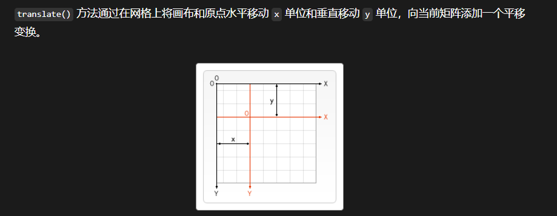
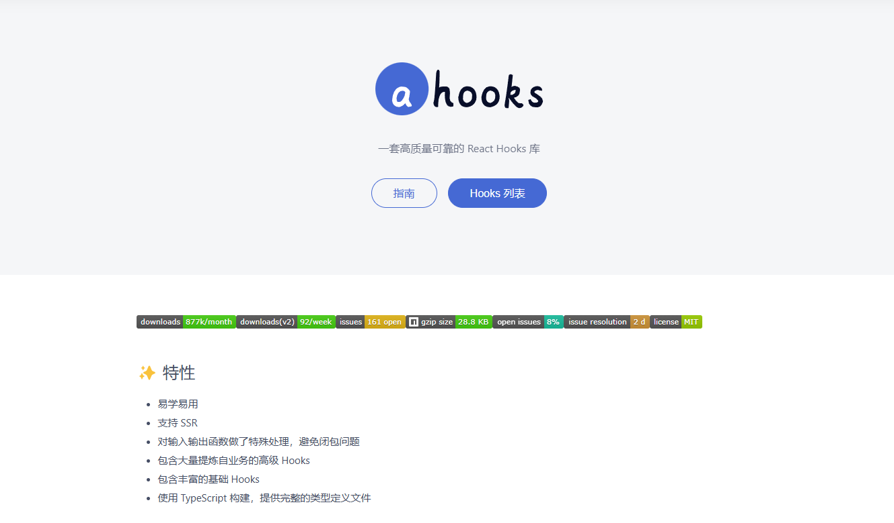

# 自定义hooks

前几章我们已经介绍了React内置的hooks(`useState, useEffect, useContext, useReducer, useRef, useMemo, useCallback, useLayoutEffect, useImperativeHandle, useDebugValue` 等等)，接下来我们介绍如何自定义hooks。

## 为什么需要自定义hooks?

因为在实际开发中，React的内置hooks并不能满足我们所有的需求，比如一些复杂的业务逻辑，或者是一些使用场景，需要我们自己来使用自定义hooks实现。


## 自定义hooks的规则

1. 自定义hooks必须以`use`开头
2. 自定义hooks可以调用其他hooks(内置的hooks和自定义的hooks)

## 案例

例如我们做一个水印的需求，这个在业务中是很常见的需求，为此我们封装一个自定义hooks，来实现这个需求。


1. 首先我们定义一个水印的配置项

```tsx
import { useEffect, useState } from "react"
export interface WatermarkOptions {
    content: string // 水印文本
    width?: number  // 水印宽度
    height?: number // 水印高度
    fontSize?: number // 水印字体大小
    fontColor?: string // 水印字体颜色
    zIndex?: number // 水印层级
    rotate?: number // 水印旋转角度
    gapX?: number // 水印横向间距
    gapY?: number // 水印纵向间距
}
```

2. 然后我们定义水印的默认值

```tsx
const defaultOptions = (): Partial<WatermarkOptions> => {
    //默认铺满整个页面
    const { width, height } = document.documentElement.getBoundingClientRect()
    return {
        width: width,
        height: height,
        fontSize: 16,
        fontColor: 'black',
        zIndex: 9999,
        rotate: -30,
        gapX: 200,
        gapY: 100
    }
}
```

3. 串联整体实现思路，首先水印如何实现呢，我们通过`canvas`来实现，根据配置项，设置canvas对应的属性，然后通过`toDataURL`生成水印图片，最后创建一个元素，将水印图片设置为元素的背景图片，并设置样式，如果要操作DOM元素，我们需要通过useEffect副作用函数操作。

```tsx
import { useEffect, useState } from "react"
export interface WatermarkOptions {
    content: string // 水印文本
    width?: number  // 水印宽度
    height?: number // 水印高度
    fontSize?: number // 水印字体大小
    fontColor?: string // 水印字体颜色
    zIndex?: number // 水印层级
    rotate?: number // 水印旋转角度
    gapX?: number // 水印横向间距
    gapY?: number // 水印纵向间距
}
// 默认配置
const defaultOptions = (): Partial<WatermarkOptions> => {
    const { width, height } = document.documentElement.getBoundingClientRect()
    return {
        width: width,
        height: height,
        fontSize: 16,
        fontColor: 'black',
        zIndex: 9999,
        rotate: -30,
        gapX: 200,
        gapY: 100
    }
}

export const useWatermark = (options: WatermarkOptions) => {
    const [watermarkOptions, setWatermarkOptions] = useState<WatermarkOptions>(options)
    const opts = Object.assign({}, defaultOptions(), watermarkOptions)
    const updateWatermark = (newOptions: Partial<WatermarkOptions>) => {
        setWatermarkOptions(prev => ({
            ...prev,
            ...newOptions
        }))
    }
    useEffect(() => {
        const canvas = document.createElement('canvas')
        const ctx = canvas.getContext('2d') as CanvasRenderingContext2D
        canvas.width = opts.gapX!
        canvas.height = opts.gapY!
        //默认
        ctx.translate(opts.gapX! / 2, opts.gapY! / 2) 
        ctx.rotate((opts.rotate! * Math.PI) / 180) 
        ctx.font = `${opts.fontSize}px sans-serif`
        ctx.textAlign = 'center'
        ctx.fillStyle = opts.fontColor!
        ctx.globalAlpha = 0.15
        ctx.fillText(opts.content, 0, 0)
        const watermarkDiv = document.createElement('div')
        watermarkDiv.id = 'watermark'
        watermarkDiv.style.position = 'fixed'
        watermarkDiv.style.top = '0'
        watermarkDiv.style.left = '0'
        watermarkDiv.style.width = `${opts.width}px`
        watermarkDiv.style.height = `${opts.height}px`
        watermarkDiv.style.pointerEvents = 'none'
        watermarkDiv.style.zIndex = `${opts.zIndex}`
        watermarkDiv.style.overflow = 'hidden'
        watermarkDiv.style.backgroundImage = `url(${canvas.toDataURL()})`
        watermarkDiv.style.backgroundSize = `${opts.gapX}px ${opts.gapY}px`
        document.body.appendChild(watermarkDiv)
        
        return () => {
            document.body.removeChild(watermarkDiv)
        }
    }, [opts])

    return [updateWatermark, opts] as const
}
```

4. 代码详解

```tsx
ctx.translate(opts.gapX! / 2, opts.gapY! / 2) 
ctx.rotate((opts.rotate! * Math.PI) / 180) 
ctx.font = `${opts.fontSize}px sans-serif`
ctx.textAlign = 'center'
ctx.fillStyle = opts.fontColor!
ctx.globalAlpha = 0.15
ctx.fillText(opts.content, 0, 0)
```

大家对于这块可能比较懵, 我们这里详细解释一下,首先我们通过gapX,gapY,给canvas设置了宽高这里默认值是，200,100，也就是200px*100px的一个长方形，但是canvas默认的坐标是(0,0), 这样会导致文字显示不出来，所以我们把文字挪到中心点，那么中心点怎么求呢？就是宽高/2，就算出中心点，然后通过`ctx.translate(opts.gapX! / 2, opts.gapY! / 2)`，将文字挪到中心点。
然后通过`ctx.rotate((opts.rotate! * Math.PI) / 180)`，将文字旋转，然后通过`ctx.font = `${opts.fontSize}px sans-serif``，设置字体，然后通过`ctx.textAlign = 'center'`，设置文字对齐方式，然后通过`ctx.fillStyle = opts.fontColor!`，设置文字颜色，然后通过`ctx.globalAlpha = 0.15`，设置文字透明度，最后通过`ctx.fillText(opts.content, 0, 0)`，绘制文字。



5. 在组件中使用

```tsx
import React from 'react'
import { useWatermark } from './hooks/useWatermark';
const App: React.FC = () => {
   const [updateWatermark, opts] = useWatermark({
      content: '小满马上拨款',
   }) // 水印
   const update = () => {
      updateWatermark({
         content: '更新水印',
      })
   }
   return <>
      <div>{JSON.stringify(opts)}</div>
      <button onClick={update}>更新水印</button>
   </>;
}
export default App;
```


## 那么在工作中，我们需要频繁的定义hooks吗？

我们并不需要重复的造轮子，已经有很多现成的库可以使用，比如`ahooks`,`react-use`,`SWR`,`react-hook-form`等等，这些库都是经过社区验证的，可以放心使用。

这里使用ahooks 举例

### 安装ahooks



文档地址:https://ahooks.js.org/zh-CN/hooks/use-request/index

```bash
npm install --save ahooks
# or
yarn add ahooks
# or
pnpm add ahooks
# or
bun add ahooks
```

#### 小案例1：useMount 组件挂载完成执行

```tsx
import React from 'react'
import { useMount } from 'ahooks'

const App: React.FC = () => {
   useMount(() => {
      console.log('mounted')
   })
   return <>
      <div></div>
   </>;
}

export default App;
```


#### 小案例2：useRequest 请求

useRequest 是ahooks 中非常强大的一个hook，可以用来处理请求，比如自动请求/手动请求，轮询，防抖，节流，屏幕聚焦重新请求，错误重试，loading delay，SWR(stale-while-revalidate)，缓存等等。

```tsx
import React from 'react'
import { useMount, useRequest } from 'ahooks'

const App: React.FC = () => {
   const { data, run } = useRequest(() => {
      return fetch('https://api.github.com/users/github').then(res => res.json())
   }, {
      debounceWait: 300, // 防抖
      manual: true, // 手动触发
   })
   return <>
      <div>{JSON.stringify(data)}</div>
      <button onClick={run}>请求</button>
   </>;
}

export default App;
```
:::tip
其他有趣的hooks，大家可以去官网查看，这里就不一一列举了。
:::


