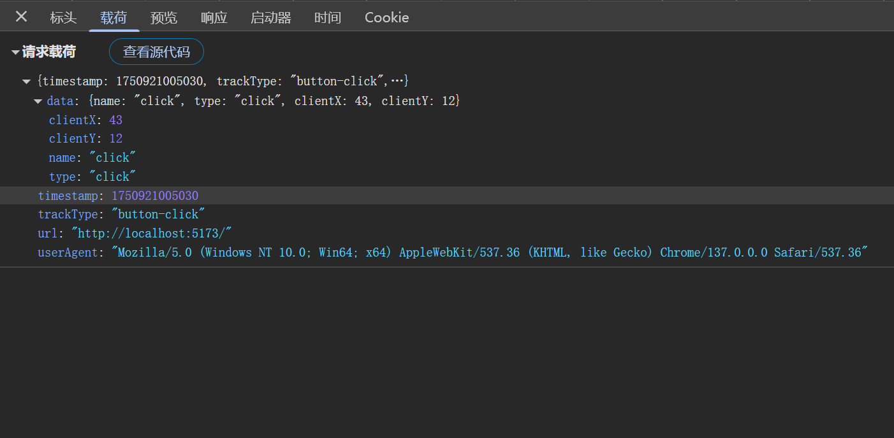

# HOC(Higher Order Component) 高阶组件

:::warning
本章可以选择性观看
1. 在使用hooks写法的时候，HOC的场景会缩小
2. 为什么出这一章节，面试的时候还是会问，所以还是得了解下
3. 了解相关的规范，不至于在实际项目开发中不懂理论
:::

什么是高阶组件？

高阶组件就是一个组件，它接受另一个组件作为参数，并返回一个新的组件，（如果你学过Vue的话，跟Vue中的二次封装组件有点类似）新的组件可以复用旧组件的逻辑，并可以添加新的功能。常用于类组件中，虽然目前都是hooks写法会缩小HOC的使用场景，但还是有部分场景会用到`(因为人是死的，代码是活的，要灵活变通)🤡`。

## 入门级用法

**注意点**

- HOC不会修改传入的组件，而是使用组合的方式，通过将原组件包裹在一个容器组件中来实现功能扩展
- 注意避免多层嵌套，一般HOC的嵌套层级不要超过3层
- HOC的命名规范：`with`开头，如`withLoading`、`withAuth`等

**代码示例**

我们以一个权限判断的例子来入门HOC，并且可以灵活的复用这个逻辑。

```tsx
enum Role {
  ADMIN = 'admin',
  USER = 'user',
}
const withAuthorization = (role: Role) => (Component: React.FC) => {
  // 判断是否具有权限的函数
  const isAuthorized = (role: Role) => {
    return role === Role.ADMIN;
  }
  return (props: any) => {
    // 判断是否具有权限
    if (isAuthorized(role)) {
      //把props透传给组件
      return <Component {...props} />
    } else {
      // 没有权限则返回一个提示
      return <div>抱歉，您没有权限访问该页面</div>
    }
  }
}

const AdminPage = withAuthorization(Role.ADMIN)(() => {
  return <div>管理员页面</div> //有权限输出
})

const UserPage = withAuthorization(Role.USER)(() => {
  return <div>用户页面</div> //没有权限不输出
})
```

## 进阶用法

封装一个通用的HOC，实现埋点统计，比如点击事件，页面挂载，页面卸载等。


封装一个埋点服务可以根据自己的业务自行扩展
1. `trackType`表示发送埋点的组件类型
2. `data`表示发送的数据
3. `eventData`表示需要统计的用户行为数据
4. `navigator.sendBeacon`是浏览器提供的一种安全可靠的异步数据传输方式，适合发送少量数据，比如埋点数据,并且浏览器关闭时，数据也会发送，不会阻塞页面加载
```ts
const trackService = {
  sendEvent: <T,>(trackType: string, data: T = null as T) => {
    const eventData = {
      timestamp: Date.now(), // 时间戳
      trackType, // 事件类型
      data, // 事件数据
      userAgent: navigator.userAgent, // 用户代理
      url: window.location.href, // 当前URL
    }
    //发送数据
    navigator.sendBeacon(
      'http://localhost:5173',
      JSON.stringify(eventData)
    )
  }
}
```

实现HOC高阶组件,通过useEffect统计组件挂载和卸载，并且封装一个trackEvent方法，传递给子组件，子组件可以自行调用，统计用户行为。

```tsx
const withTrack = (Component: React.ComponentType<any>, trackType: string) => {
  return (props: any) => {
    useEffect(() => {
      //发送数据 组件挂载
      trackService.sendEvent(`${trackType}-MOUNT`)
      return () => {
        //发送数据 组件卸载
        trackService.sendEvent(`${trackType}-UNMOUNT`)
      }
    }, [])

    //处理事件
    const trackEvent = (eventType: string, data: any) => {
      trackService.sendEvent(`${trackType}-${eventType}`, data)
    }


    return <Component {...props} trackEvent={trackEvent} />
  }
}
```

使用HOC高阶组件,注册了一个button按钮，并传递了trackEvent方法，子组件可以自行调用，统计用户行为。

```tsx
const Button = ({ trackEvent }) => {
  // 点击事件
  const handleClick = (e: React.MouseEvent<HTMLButtonElement>) => {
    trackEvent(e.type, {
      name: e.type,
      type: e.type,
      clientX: e.clientX,
      clientY: e.clientY,
    })
  }

  return <button   onClick={handleClick}>我是按钮</button>
}
// 使用HOC高阶组件
const TrackButton = withTrack(Button, 'button')
// 使用组件
const App = () => {
  return <div>
    <TrackButton />
  </div>
}

export default App
```

上报的数据格式预览(可以根据自己的业务自行扩展或者修改)




## 🤖 Assistant

好的，我们来深入探讨一下这个问题。

你的观察非常敏锐。自 React 16.8 引入 Hooks 以来，函数式组件和 Hooks 已经成为现代 React 开发的绝对主流。在2025年的今天，对于绝大多数场景，高阶组件 (HOC) 的使用频率已经大幅降低，其核心能力几乎都可以被自定义 Hooks (Custom Hooks) 以一种更优雅、更灵活的方式替代。

简单来说，**是的，自定义 Hooks 在绝大多数情况下是 HOC 的现代化替代方案。**

---

### **1. 核心解决方案 (Core Solution)**

以下是一个经典的 HOC 场景：为组件注入用户数据。我们将展示 HOC 的实现，以及如何用一个自定义 Hook 来实现同样的功能，你会立刻看到两者的差异。

假设我们有一个 API `fetchUserData(userId)`，它返回一个 Promise，解析后得到用户信息。

#### **场景：为组件提供当前用户信息**

**A. HOC 实现 (`withUserData.jsx`)**

```jsx
import React, { useState, useEffect } from 'react';

// 模拟一个API调用
const fetchUserData = (userId) => {
  console.log(`Fetching data for user: ${userId}`);
  return new Promise((resolve) => {
    setTimeout(() => {
      resolve({ id: userId, name: `User ${userId}`, email: `user${userId}@example.com` });
    }, 1000);
  });
};

/**
 * withUserData 是一个高阶组件 (HOC)
 * @param {React.Component} WrappedComponent - 需要被注入 user 数据的组件
 * @param {string} userId - 要获取数据的用户ID
 * @returns {React.Component} - 一个注入了 user, isLoading 状态的新组件
 */
function withUserData(WrappedComponent, userId) {
  // HOC 返回一个新的组件
  return function WithUserDataComponent(props) {
    const [user, setUser] = useState(null);
    const [isLoading, setIsLoading] = useState(true);

    useEffect(() => {
      setIsLoading(true);
      fetchUserData(userId)
        .then(data => {
          setUser(data);
        })
        .finally(() => {
          setIsLoading(false);
        });
    }, [userId]); // 依赖 userId，当它变化时重新获取数据

    // 将获取的数据和加载状态作为 props 传递给被包装的组件
    // 同时必须透传所有原始的 props
    return <WrappedComponent {...props} user={user} isLoading={isLoading} />;
  };
}

// --- 使用 HOC ---
// 原始的展示组件
function UserProfile({ user, isLoading, extraProp }) {
  if (isLoading) {
    return <div>Loading user profile...</div>;
  }
  return (
    <div>
      <h1>{user?.name}</h1>
      <p>Email: {user?.email}</p>
      <p>Extra Prop: {extraProp}</p>
    </div>
  );
}

// 使用 HOC 包装组件
export const UserProfileWithData = withUserData(UserProfile, '123');

// 在应用中渲染
// <UserProfileWithData extraProp="some value" />
```

**B. 自定义 Hook 实现 (`useUserData.js` & `UserProfile.jsx`)**

```jsx
import { useState, useEffect } from 'react';

// 模拟的API调用 (与上面相同)
const fetchUserData = (userId) => {
  console.log(`Fetching data for user: ${userId}`);
  return new Promise((resolve) => {
    setTimeout(() => {
      resolve({ id: userId, name: `User ${userId}`, email: `user${userId}@example.com` });
    }, 1000);
  });
};


/**
 * useUserData 是一个自定义 Hook
 * @param {string} userId - 要获取数据的用户ID
 * @returns {{user: object | null, isLoading: boolean}} - 包含用户数据和加载状态的对象
 */
export function useUserData(userId) {
  const [user, setUser] = useState(null);
  const [isLoading, setIsLoading] = useState(true);

  useEffect(() => {
    // 防止在 userId 为空时发起请求
    if (!userId) {
      setIsLoading(false);
      return;
    }
    
    setIsLoading(true);
    fetchUserData(userId)
      .then(data => {
        setUser(data);
      })
      .finally(() => {
        setIsLoading(false);
      });
  }, [userId]);

  // Hook 返回状态和任何需要的函数，而不是一个组件
  return { user, isLoading };
}


// --- 使用 Hook ---
// 组件直接使用 Hook 来获取状态
export function UserProfile({ userId, extraProp }) {
  // 直接、清晰地在组件内部调用 Hook
  const { user, isLoading } = useUserData(userId);

  if (isLoading) {
    return <div>Loading user profile...</div>;
  }
  
  return (
    <div>
      <h1>{user?.name}</h1>
      <p>Email: {user?.email}</p>
      <p>Extra Prop: {extraProp}</p>
    </div>
  );
}

// 在应用中渲染，数据来源非常清晰
// <UserProfile userId="123" extraProp="some value" />
```

---

### **2. 方案解析 (Explanation)**

对比以上两个例子，自定义 Hook 的优势显而易见：

1. **更明确的数据流**: 在 `UserProfile` (Hook版本) 中，我们通过 `const { user, isLoading } = useUserData(userId);` 这行代码，能非常清晰地看到 `user` 和 `isLoading` 这两个状态来自于 `useUserData` 这个 Hook。而在 HOC 版本中，`user` 和 `isLoading` 是作为 props "凭空" 出现的，你必须去查看组件的导出语句 `withUserData(UserProfile, '123')` 才能追溯其来源，这在大型应用中会变得非常困难。

2. **避免“包装地狱” (Wrapper Hell)**: 如果一个组件需要多种逻辑复用，HOC 的写法会是 `withAuth(withRouter(withLogging(MyComponent)))`。这会在 React DevTools 中形成多层无意义的组件嵌套，难以调试。而使用 Hooks，则是在组件内部平铺地调用：
 ```jsx
 function MyComponent() {
 const { user } = useAuth();
 const router = useRouter();
 useLogging();
 // ...
 }
 ```
 这种方式不会增加组件树的深度。

3. **解决了 Props 命名冲突问题**: 如果两个 HOC 都向组件注入了一个名为 `data` 的 prop，后者会覆盖前者，引发难以察觉的 bug。Hooks 完美地解决了这个问题，因为我们可以对 Hook 返回的对象进行解构和重命名：
 ```jsx
 const { data: userData } = useUserData();
 const { data: postsData } = usePostsData();
 ```

4. **更灵活的组合与使用**: Hook 返回的是值（状态、函数等），你可以在组件的逻辑中任意使用和组合这些值。而 HOC 是组件级别的封装，它的粒度更粗，灵活性较差。例如，你无法轻易地在两个 HOC 之间共享状态。

---

### **3. 备选方案与权衡 (Alternative Solutions & Trade-offs)**

尽管 Hooks 是首选，但在 Hooks 出现之前，除了 HOC，还有 **Render Props** 模式。了解它有助于我们理解 React 模式的演进。

| 模式 | 推荐指数 | 优点 | 缺点 | 核心场景 |
| :--- | :--- | :--- | :--- | :--- |
| **自定义 Hooks** | ⭐⭐⭐⭐⭐ (强烈推荐) | 1. 代码清晰，来源明确。<br>2. 避免组件嵌套地狱。<br>3. 无 props 命名冲突。<br>4. 逻辑与视图分离彻底。<br>5. 完美支持 TypeScript 类型推导。 | 1. 必须在函数组件顶层调用。 | **所有**状态逻辑和副作用的复用。 |
| **HOC** | ⭐⭐ (不推荐，仅用于维护旧项目或极特殊场景) | 1. 在类组件时代是主流模式。<br>2. 对于一些纯粹的 UI 包装能力较强。 | 1. “包装地狱”。<br>2. Props 来源不明确。<br>3. 易导致 Props 命名冲突。<br>4. TypeScript 类型定义复杂。 | 维护旧的类组件代码库；需要修改最终渲染元素的某些非逻辑性 props（如 `className`）。 |
| **Render Props** | ⭐⭐ (不推荐，已被 Hooks 替代) | 1. Props 来源比 HOC 明确。<br>2. 解决了命名冲突问题。 | 1. 容易产生“回调地狱”式的 JSX 嵌套。<br>2. 代码可读性较差。 | 在一些 UI 库中（如下拉菜单、模态框）仍有应用，用于将渲染控制权交给父组件。 |

---

### **4. 前瞻性建议与风险预警 (Proactive Advice & Risk Warning)**

* **[前瞻性分析]：HOC 是否已死？**
 不完全是，但在99%的业务逻辑复用场景中，它应该被视为过时模式。它仍然存在的少数合理场景是：当你的逻辑需要**真正地**操作或增强组件本身，而非仅仅提供状态时。一个经典的例子是 `React.memo`，它就是一个 HOC。另一个是 Styled-Components 的 `styled(Component)` API，它返回一个应用了样式的新组件。这些场景都涉及对组件渲染输出的深度定制，这是 Hooks 无法直接做到的。

* **[前瞻性分析]：Hooks 与 React Server Components (RSC) 的关系**
 随着 React 19 及以后版本对 RSC 的普及，数据获取的模式正在发生新的变革。在 RSC 模型中，许多类似 `useUserData` 的数据获取逻辑会直接在服务端完成，根本不会出现在客户端组件中。客户端组件会直接通过 props 接收已经获取到的数据。`use` Hook 的引入进一步简化了在客户端组件中处理服务端 Promise 的过程。这意味着，未来客户端自定义 Hooks 会更专注于处理客户端状态（如 UI 交互、表单状态、动画）和客户端数据请求（如用户操作触发的数据更新），而不是页面初始加载所需的数据。

* **[第二层思维]：迁移成本与团队认知**
 如果你的团队正在维护一个大量使用 HOC 的老旧项目，直接全部重构为 Hooks 可能成本高昂。正确的策略应该是：**新功能全部使用 Hooks，对于需要修改的旧功能，在评估工时后逐步重构为 Hooks**。确保团队所有成员都深刻理解 Hooks 的工作原理（特别是闭包、依赖数组等），避免写出有 bug 的 `useEffect`，这是采用 Hooks 模式后最常见的技术债来源。

* **风险预警：谨慎使用第三方 HOC 库**
 如果你在使用一些旧的第三方库，它可能只提供了 HOC 形式的 API。在2025年，这是一个危险信号，表明该库可能已经疏于维护。在引入这类库之前，应优先寻找提供 Hooks API 的现代化替代品。

---

### **5. 参考资料 (References)**

1. **React 官方文档 - 自定义 Hook**: [https://react.dev/learn/reusing-logic-with-custom-hooks](https://react.dev/learn/reusing-logic-with-custom-hooks)
2. **React 官方文档 - 高阶组件 (作为历史参考)**: [https://legacy.reactjs.org/docs/higher-order-components.html](https://legacy.reactjs.org/docs/higher-order-components.html)
3. **React 官方博文 - Hooks 介绍**: [https://react.dev/blog/2018/10/16/a-look-inside-react.html](https://react.dev/blog/2018/10/16/a-look-inside-react.html) (这篇历史文章详细阐述了创造 Hooks 的动机，包括 HOC 和 Render Props 的痛点)
