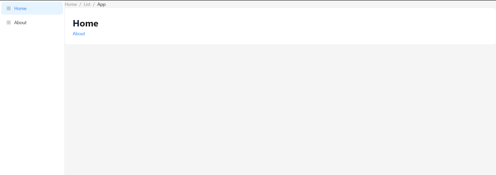

# 路由

React-Router V7 的路由种类是非常多的，有`嵌套路由` `布局路由` `索引路由` `前缀路由` `动态路由`，大致上是分为这五种的，下面我们一一介绍

## Layout

 我们在演示上面几种路由之前，先对界面进行一个布局，方便我们后续的演示,UI组件我们使用`antd`。

 ```bash
npm install antd
 ```

 我们创建一个`layout`文件夹，在文件夹中创建一个`Content` `Header` `Menu` 文件夹，在文件夹中创建一个`index.tsx`文件，文件内容如下：

- src/layout/Menu/index.tsx `菜单页面`

```tsx
import { Menu as AntdMenu } from 'antd';
import { AppstoreOutlined } from '@ant-design/icons';
import type { MenuProps } from 'antd'
import { useNavigate } from 'react-router';
export default function Menu() {
    const navigate = useNavigate();//编程式导航
    const handleClick: MenuProps['onClick'] = (info) => {
         navigate(info.key) // 点击菜单项时，导航到对应的页面
    };
    const menuItems = [
        {
            key: '/home',
            label: 'Home',
            icon: <AppstoreOutlined />,
        },
        {
            key: '/about',
            label: 'About',
            icon: <AppstoreOutlined />,
        },
    ];
    return <AntdMenu onClick={handleClick} style={{ height: '100vh' }} items={menuItems} />;
}

```

- src/layout/Header/index.tsx `头部页面`

```tsx
import { Breadcrumb } from 'antd';

export default function Header() {
  return <Breadcrumb 
    items={[
      {
        title: 'Home',
      },
      {
        title: 'List',
      },
      {
        title: 'App',
      },
    ]}
  />;
}
```

- src/layout/Content/index.tsx `内容页面`

```tsx
import { Outlet } from 'react-router';
export default function Content() {
  return <Outlet />;
}
```




## 嵌套路由

嵌套路由就是父路由中嵌套子路由`children`，子路由可以继承父路由的布局，也可以有自己的布局。

注意事项：

- 父路由的path 是 `index`开始，所以访问子路由的时候需要加上父路由的path例如 `/index/home` `/index/about`
- 子路由不需要增加`/`了直接写子路由的path即可
- 子路由默认是不显示的，需要父路由通过 `Outlet` 组件来显示子路由 outlet 就是类似于Vue的`<router-view>`展示子路由的一个容器

```tsx
const router = createBrowserRouter([
    {
        path: '/index',
        Component: Layout, // 父路由
        children: [ // [!code highlight]
            {
                path: 'home',
                Component: Home, // 子路由
            },
            {
                path: 'about',
                Component: About, // 子路由
            },
        ]
    },
]);

import { Outlet } from 'react-router';
function Content() {
  return <Outlet />;
}
```

## 布局路由

布局路由是一种特殊的嵌套路由，父路由可以省略 `path`，这样不会向 URL 添加额外的路径段：

```tsx
const router = createBrowserRouter([
    { 
        // path: '/index', //省略 // [!code highlight]
        Component: Layout,
        children: [
            {
                path: 'home',
                Component: Home,
            },
            {
                path: 'about',
                Component: About,
            },
        ]
    },
]);
```

## 索引路由

索引路由使用 `index: true` 来定义，作为父路由的默认子路由：

```ts
{ index: true, Component: Home }
```
索引路由在其父级的 URL 处呈现到其父级的Outlet中

```tsx
const router = createBrowserRouter([
    {
        path: '/',
        Component: Layout,
        children: [
            {
                index: true, // [!code highlight]
                // path: 'home',
                Component: Home,
            },
            {
                path: 'about',
                Component: About,
            },
        ]
    },
]);
```

## 前缀路由

前缀路由只设置 `path` 而不设置 `Component`，用于给一组路由添加统一的路径前缀：

```tsx
const router = createBrowserRouter([
    {
        path: '/project',
        //Component: Layout, //省略 // [!code highlight]
        children: [
            {
                path: 'home',
                Component: Home,
            },
            {
                path: 'about',
                Component: About,
            },
        ]
    },
]);
```

## 动态路由

动态路由通过 `:参数名` 语法来定义动态段：

访问规则如下 `http://localhost:3000/home/123`

```tsx
const router = createBrowserRouter([
    {
        path: '/',
        Component: Layout,
        children: [
            {
                path: 'home/:id', // [!code highlight]
                Component: Home,
            },
            {
                path: 'about',
                Component: About,
            },
        ]
    },
]);


//在组件中获取参数
import { useParams } from "react-router";

function Card() {
  let params = useParams();
  console.log(params.id);
}
```


