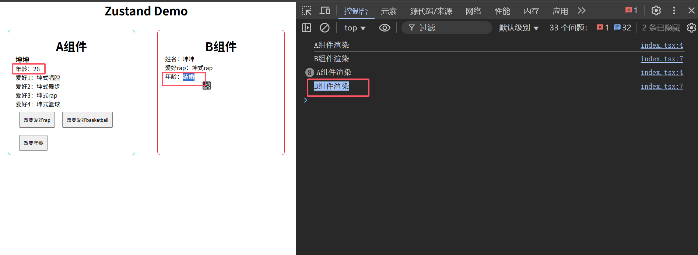

# 订阅

zustand 的 subscribe，可以订阅一个状态，当状态变化时，会触发回调函数。

## 订阅一个状态

只要store 的 state 发生变化，就会触发回调函数，`另外就是这个订阅可以在组件内部订阅，也可以在组件外部订阅`,如果在组件内部订阅需要放到`useEffect`中,防止重复订阅。

```tsx
const store = create((set) => ({
  count: 0,
}));
//外部订阅
store.subscribe((state) => {
  console.log(state.count);
});
//组件内部订阅
useEffect(() => {
  store.subscribe((state) => {
    console.log(state.count);
  });
}, []);
```

## 案例

比如我们需要观察年龄的变化，大于等于26 就提示可以结婚了，小于26 就提示还不能结婚，如果使用选择器的写法，age每次更新都会重新渲染组件，这样就会导致组件的频繁渲染。

```tsx
const store = create((set) => ({
  age: 0,
}));
//组件里面 age 每次更新都会重新渲染组件 
const { age } = useStore(useShallow((state) => ({
  age: state.age,
})));
```
性能优化，采用订阅的模式，age 变化的时候，会调用回调函数，但是不会重新渲染组件。

```tsx
const store = create((set) => ({
  age: 0,
}));

const [status,setStatus] = useState('单身')
//只会更新一次组件
useStore.subscribe((state) => {
  if(state.age >= 26){
    setStatus('结婚')
  }else{
    setStatus('单身')
  }
});
return <div>{status}</div>
```
持续优化，目前的订阅只要是store内部任意的state发生变化，都会触发回调函数，我们希望只订阅age的变化，可以使用中间件`subscribeWithSelector` 订阅单个状态。

```tsx
const store = create(subscribeWithSelector((set) => ({
  age: 0,
  name: '张三',
})));
const [status,setStatus] = useState('单身')
//订阅age的变化 并且组件渲染一次
useStore.subscribe(state => state.age, (age,prevAge) => {
   if(age >= 26){
    setStatus('结婚')
   }else{
    setStatus('单身')
   }
});
```


## 补充用法

1. subscribe 会返回一个取消订阅的函数，可以手动取消订阅。

```tsx
const unSubscribe = useStore.subscribe((state) => {
  console.log(state.age);
});
unSubscribe(); //取消订阅
```
2. 当你使用了`subscribeWithSelector`中间件的时候会多出来第三个参数`options`

- equalityFn 比较函数
- fireImmediately 是否立即触发

```tsx
const unSubscribe = useStore.subscribe(state => state.age, (age,prevAge) => {
  console.log(age,prevAge);
}, {
  equalityFn: (a, b) => a === b, // 默认是浅比较，如果需要深比较，可以传入一个比较函数
  fireImmediately: true, // 默认是false，如果需要立即触发，可以传入true
});
```
